# 00-INDEX-Video-AI-Toolkits

## โครงสร้างรายวิชา (Course Structure)

```mermaid
graph TD
    A[AI Toolkits Course] --> B(Session 1: Foundations & Ethics)
    A --> C(Session 2: Lesson Plan & Assessment)
    A --> D(Session 3: Multimedia & Video Gen)
    A --> E(Session 4: Publishing & Evaluation)
    
    B --> EP01[EP01: Introduction]
    B --> EP02[EP02: Into the Content]
    B --> EP03[EP03: AI Mindset & Fact-Checking]
    B --> EP04[EP04: AI Ethics & Prompt Engineering]
    
    C --> EP05[EP05: Lesson Plan Design]
    C --> EP06[EP06: Advanced Prompting for Lesson Plans]
    C --> EP07[EP07: AI-Powered Assessment & PISA]
    C --> EP08[EP08: NotebookLM & Mind Mapping]
    
    D --> EP09[EP09: Paperless & Instructional Design]
    D --> EP10[EP10: Multimedia & E-book Creation]
    D --> EP11[EP11: Video Generation & Scripting]
    
    E --> EP12[EP12: Video Editing with Canva]
    E --> EP13[EP13: Video Publishing & YouTube]
    E --> EP14[EP14: Evaluation & Web App Assessment]
```

## รายการตอน (Episode List)

| ลำดับ (EP) | ไฟล์ (File) | หัวข้อเรื่อง (Topic) |
| --- | --- | --- |
| 01 | [[EP01-Introduction-to-Video-AI]] | ปฐมนิเทศและภาพรวมเครื่องมือปัญญาประดิษฐ์สำหรับวิดีโอ |
| 02 | [[EP02-Into-the-Content]] | เข้าสู่เนื้อหา (Into the Content) |
| 03 | [[EP03-AI-Mindset-and-Fact-Checking]] | การปรับตัวสู่ครูยุค AI และการตรวจสอบข้อเท็จจริง |
| 04 | [[EP04-AI-Ethics-and-Prompt-Engineering]] | จริยธรรม AI และเทคนิคการเขียนคำสั่ง (Prompt Engineering) |
| 05 | [[EP05-Lesson-Plan-Design]] | การออกแบบแผนการจัดการเรียนรู้ด้วย AI (Lesson Plan Design) |
| 06 | [[EP06-Advanced-Prompting-for-Lesson-Plans]] | เทคนิคขั้นสูงในการเขียน Prompt สำหรับแผนการสอน |
| 07 | [[EP07-AI-Powered-Assessment-and-PISA]] | การปรับแผนการสอนและการสร้างแบบทดสอบด้วย AI |
| 08 | [[EP08-NotebookLM-and-Mind-Mapping]] | การสกัดเนื้อหาด้วย NotebookLM และการสร้างสื่อประกอบ |
| 09 | [[EP09-Paperless-Classroom-and-Instructional-Design]] | ห้องเรียนไร้สมุดและการออกแบบกระบวนการจัดการเรียนรู้ |
| 10 | [[EP10-Multimedia-and-Ebook-Creation]] | การสร้างสื่อมัลติมีเดียและ E-book ด้วย AI |
| 11 | [[EP11-Video-Generation-and-Scripting]] | การเขียน Script และการสร้างวิดีโอด้วย AI |
| 12 | [[EP12-Video-Editing-with-Canva]] | การตัดต่อวิดีโอและใส่ซับไตเติลด้วย Canva |
| 13 | [[EP13-Video-Publishing-and-YouTube]] | การตกแต่งวิดีโอและการอัปโหลดลง YouTube |
| 14 | [[EP14-Evaluation-and-Web-App-Assessment]] | การประเมินผลและการออกแบบ Web App วัดผลด้วย AI |
